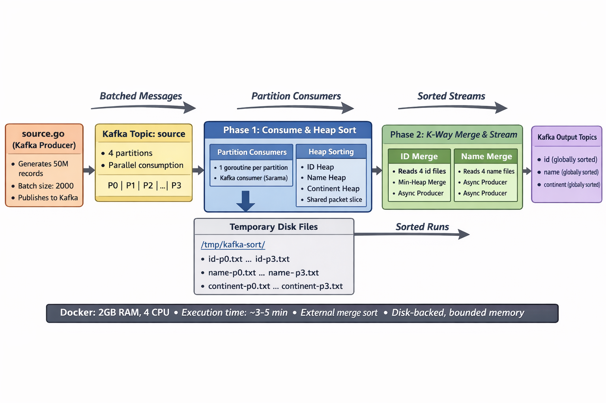
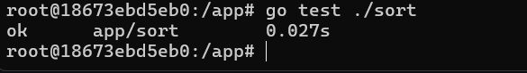
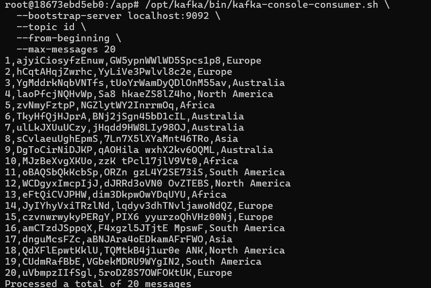

# Kafka Sort

A Dockerized Kafka application for sorting and processing data streams.

## Prerequisites

- Git
- Docker
- Docker Compose (if applicable)

## Getting Started

### HLD
## Architecture



### 1. Clone the Repository

```bash
git clone https://github.com/saianirudh205/sort_stream
cd sort_stream
```

Or pull the latest changes if you already have the repo:

```bash
git pull origin master
```

### 2. Build the Docker Image


```bash
docker pull saianirudh711/kafka-sort
```

### 3. Run the Container

```bash
docker build -t kafka-sort . && docker run --name kafka-sort --rm -it --memory=2g --memory-swap=2g --cpus=4 kafka-sort

```

**Container Resource Limits:**
- Memory: 2GB
- Swap: 2GB
- CPUs: 4 cores

### 4. Automatic Execution

Once the container starts:
- The application runs automatically
- Test cases execute for the first 20 packets
- Results are published to Kafka topics

## Testing & Monitoring

### Consume Messages from Kafka Topics

#### Option 1: From Host Machine

Connect to Kafka on `localhost:9092` using your preferred Kafka consumer.

#### Option 2: Using Kafka Console Consumer

Access the container shell and run:

```bash
# Consume messages from the 'id' topic
/opt/kafka/bin/kafka-console-consumer.sh \
  --bootstrap-server localhost:9092 \
  --topic id \
  --from-beginning \
  --max-messages 20
```

### Check Topic Offsets

To view current offsets for a topic:

```bash
/opt/kafka/bin/kafka-get-offsets.sh \
  --bootstrap-server localhost:9092 \
  --topic <topic-name>
```

## Available Topics

- `id` - Contains sorted packet IDs (sample output available for first 20 messages)
- so as `name' , `continent`

## Troubleshooting

- **Container exits immediately**: Check logs with `sudo docker logs kafka-sort`
- **Port conflicts**: Ensure port 9092 is available on your host machine


## Unit tests 
```
go test ./sort
go test ./source
```



4. Running the Application Container
The container must be run with sufficient memory and CPU resources to ensure smooth execution.
sudo docker run \
  --name kafka-sort \
  --rm \
  -it \
  --memory=2g \
  --memory-swap=2g \
  --cpus=4 \
  saianirudh711/kafka-sort

Notes:
The application runs and completes its Kafka processing tasks within 3–5 minutes.


Kafka runs locally inside the container on port 9092.


5. Kafka Topics Created
The application produces data into the following Kafka topics:
id


name


continent


Each topic contains processed records published by the application.

6. Verifying Kafka Output
After the container is running, open a new terminal and execute Kafka console consumer commands inside the container.
6.1 Access the Running Container
sudo docker exec -it kafka-sort bash


6.2 Consume Messages from id Topic
/opt/kafka/bin/kafka-console-consumer.sh \
  --bootstrap-server localhost:9092 \
  --topic id \
  --from-beginning \
  --max-messages 20

Ex out put : 



6.3 Consume Messages from name Topic
/opt/kafka/bin/kafka-console-consumer.sh \
  --bootstrap-server localhost:9092 \
  --topic name \
  --from-beginning \
  --max-messages 20


6.4 Consume Messages from continent Topic
/opt/kafka/bin/kafka-console-consumer.sh \
  --bootstrap-server localhost:9092 \
  --topic continent \
  --from-beginning \
  --max-messages 20

These commands allow verification of the first 20 messages published to each topic.

7. Checking Number of Messages in Each Topic
To determine how many messages exist in each Kafka topic, use the following command:
/opt/kafka/bin/kafka-get-offsets.sh \
  --bootstrap-server localhost:9092 \
  --topic topic-name


Example: Checking Message Count for continent Topic
/opt/kafka/bin/kafka-get-offsets.sh \
  --bootstrap-server localhost:9092 \
  --topic continent

Ex - output : 


7. Technical Details 


7.1. Batch-Based Data Upload to Source
      The application ingests source data using batch uploads rather than individual record inserts.
      Batching significantly reduces I/O overhead and improves throughput during data ingestion.
      Key Characteristics:
      Source data is uploaded in fixed-size batches


      Each batch is processed independently


      Batch ingestion improves performance and minimizes network and disk I/O calls


      Ensures stable performance under large data volumes


7.2. Multi-Threaded Processing Model
    The application uses a multi-threaded execution model to process incoming data efficiently.
    Thread Responsibilities:
    Each processing thread handles a subset of the incoming data stream


    Threads operate independently to avoid contention


    Processing is parallelized to utilize available CPU cores efficiently


7.3. Sorting Logic ( heap +  merge )
    Within each processing thread, data is sorted using standard UNIX utilities.
    Processing Flow:
    Incoming batch data is passed through heap to limit the working set size


    Data is sorted merging the collected files and ingested to the kafka topic


    Sorted results are forwarded for Kafka publication


7.4. Disk Persistence Every 2,000 Records
    To prevent excessive memory usage and ensure fault tolerance, the application persists intermediate results to disk.
    Persistence Strategy:
    Each thread writes processed data to disk after every 5,000 records


    Disk flush acts as a checkpoint mechanism


    Prevents memory exhaustion during large data processing


    Allows partial recovery in case of failure


8. Execution Summary
    The application is fully containerized using Docker.


    Kafka runs internally within the container.


    Data is processed and published to three Kafka topics: id, name, and continent.


    Execution time is approximately 3–5 minutes.


    Output verification and message counts are performed using Kafka CLI tools.


